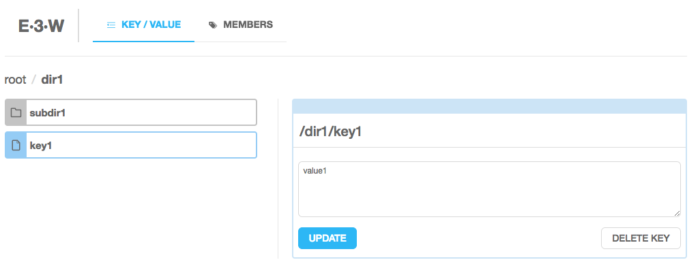
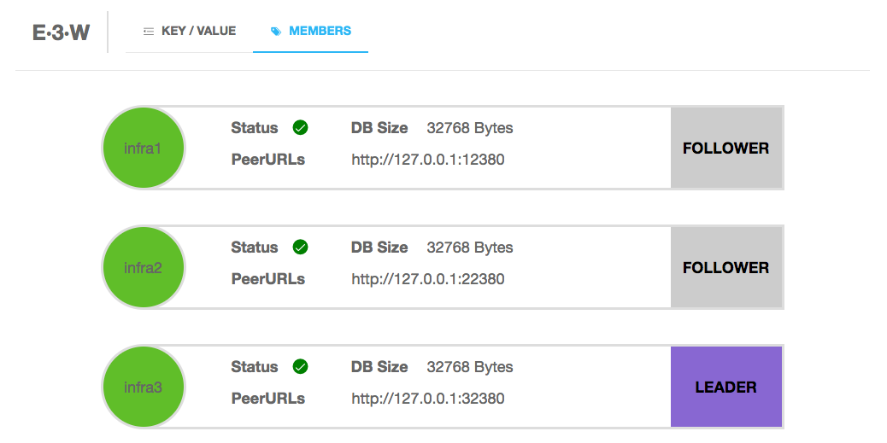
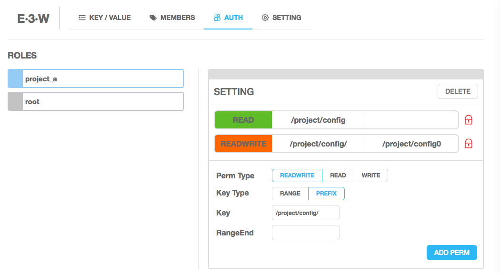
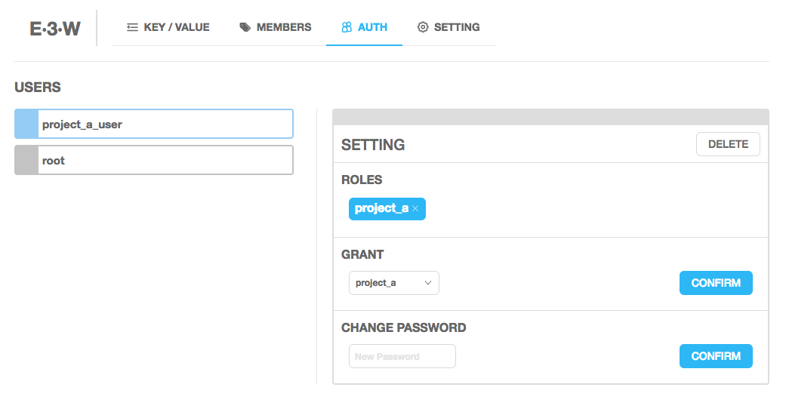
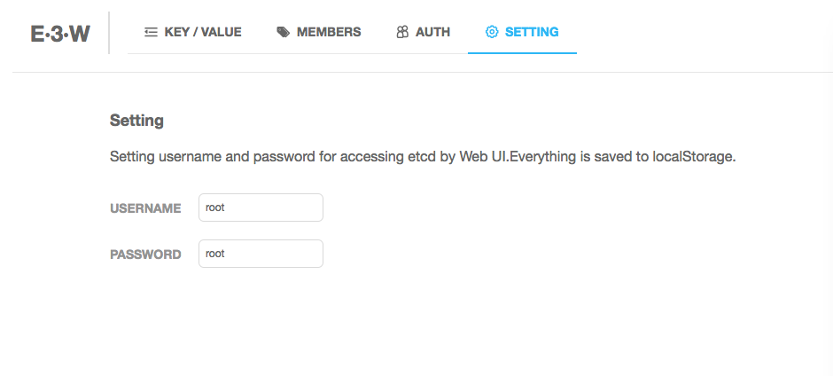

e3w
===

etcd v3 Web UI based on [Golang](https://golang.org/) && [React](https://facebook.github.io/react/), copy from [consul ui](https://github.com/hashicorp/consul/tree/master/ui) :)

supporting hierarchy on etcd v3, based on [e3ch](https://github.com/soyking/e3ch)

## Overview

KEY/VALUE



MEMBERS



ROLES



USERS



SETTING



## Usage

1.Fetch the project `go get github.com/soyking/e3w`


2.frontend

```
cd static
npm install
npm run publish
```

3.backend

a. Start etcd, such as [goreman](https://github.com/coreos/etcd/#running-a-local-etcd-cluster)

b. Install packages by [dep](https://github.com/golang/dep) if needed, `dep ensure`

c. Edit conf/config.default.ini if needed, `go build && ./e3w`

d. For auth:

```
ETCDCTL_API=3 etcdctl auth enable
# edit conf/config.default.ini[app]#auth
./e3w
# you could set your username and password in SETTING page
```

## Notice

- When you want to add some permissions in directories to a user, the implement of hierarchy in [e3ch](https://github.com/soyking/e3ch) requires you to set a directory's READ permission. For example, if role `roleA` has the permission of directory `dir1/dir2`, then it should have permissions:

	```
	KV Read:
		dir1/dir2
		[dir1/dir2/, dir1/dir20) (prefix dir1/dir2/)
	KV Write:
		[dir1/dir2/, dir1/dir20) (prefix dir1/dir2/)
	```

	When `userA` was granted `roleA`, `userA` could open the by `http://e3w-address.com/#/kv/dir1/dir2` to view and edit the key/value

- Access key/value by etcdctl, [issue](https://github.com/soyking/e3w/issues/3). But the best way to access key/value is using [e3ch](https://github.com/soyking/e3ch).
